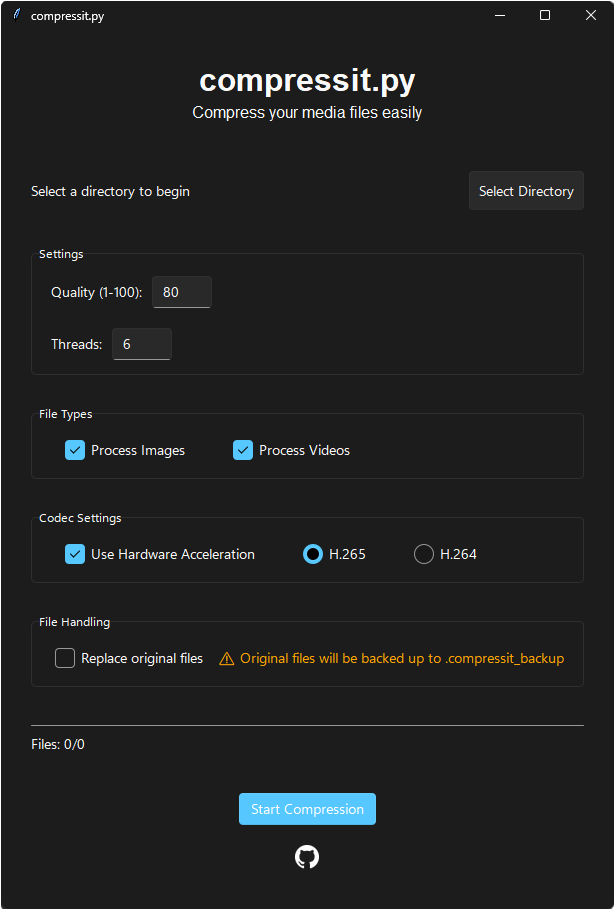

# 🗜️ compressit.py

<div align="center">

[](https://www.python.org/)
[](LICENSE)
[](https://github.com/Sprechender/compressit.py/stargazers)

A powerful Python tool for compressing media with ease.

[Features](#features) • [Installation](#installation) • [Contributing](#contributing) • [License](#license)

  
</div>

## ✨ Features

- 🚀 Fast and efficient file compression
- 📁 Support for both single files and entire directories
- 🎯 Multiple compression formats support
- 💡 Simple and intuitive command-line interface
- 🔄 Preserve directory structure during compression
- 📊 Progress tracking during compression

## 🚀 Installation
Clone the repository
```bash
git clone https://github.com/Sprechender/compressit.py.git
```
Navigate to the directory
```bash
cd compressit.py
```
Install dependencies
```bash
pip install -r requirements.txt
```
## 📝 Requirements

- Python 3.6 or higher
- Required packages listed in `requirements.txt`
- **For compilation `compile_requirements.txt` is required**

## 🤝 Contributing

Contributions are welcome! Here's how you can help:

1. Fork the repository
2. Create your feature branch (`git checkout -b feature/AmazingFeature`)
3. Commit your changes (`git commit -m 'Add some AmazingFeature'`)
4. Push to the branch (`git push origin feature/AmazingFeature`)
5. Open a Pull Request

## 📄 License

This project is licensed under the MIT License - see the [LICENSE](LICENSE) file for details.
## 📧 Contact

Marcel Schreiber (Sprechender) - "ytumy" / Discord

Project Link: [https://github.com/Sprechender/compressit.py](https://github.com/Sprechender/compressit.py)

---

<div align="center">
Made with ❤️ by <a href="https://github.com/Sprechender">Sprechender</a>
</div>
